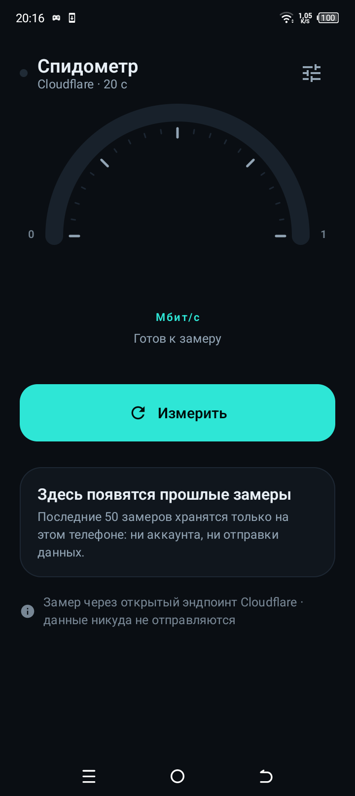
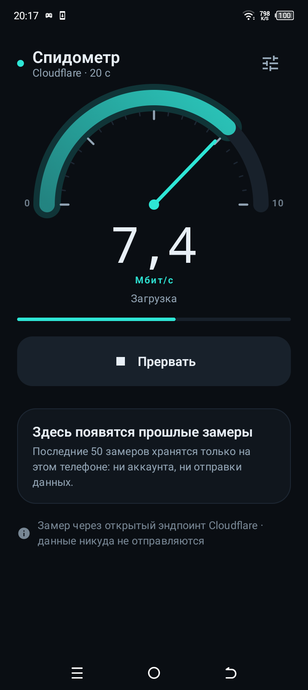
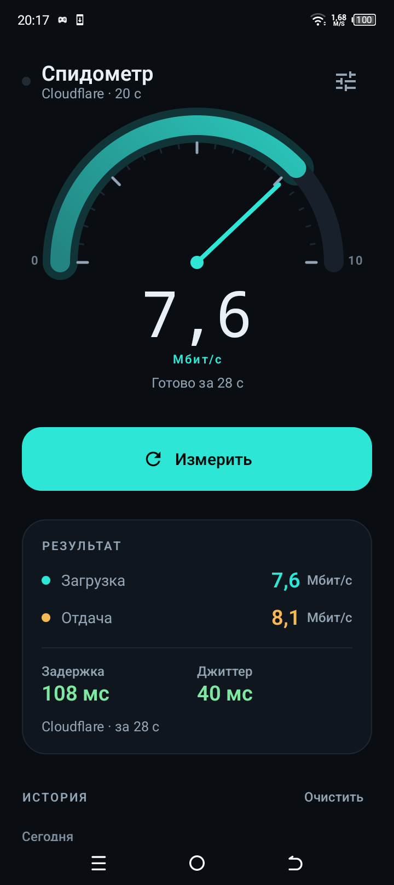
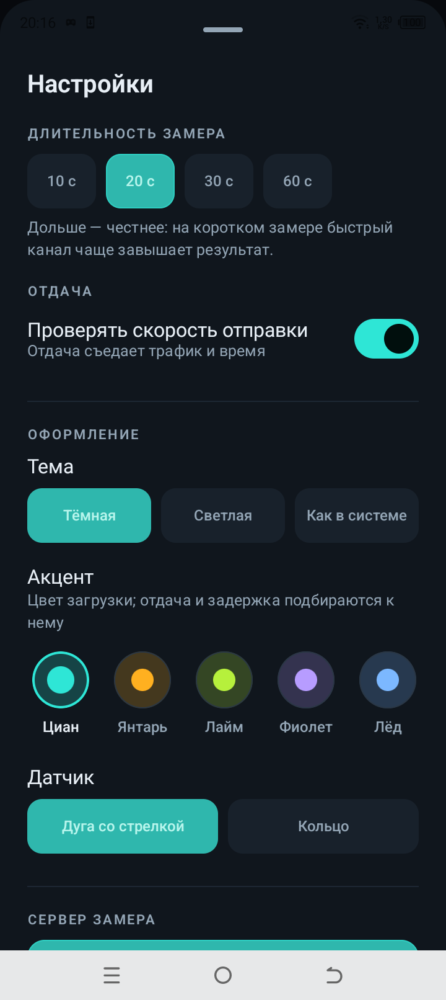
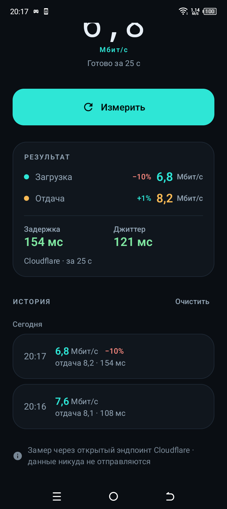

# Спидометр — измерение скорости интернета на телефоне

Приложение для Android: измеряет скорость загрузки и отдачи, задержку и
джиттер. Без аккаунтов, без рекламы, без отправки данных: единственное
разрешение — доступ в сеть.

## Что измеряет

| Метрика | Как считается |
|---------|---------------|
| Загрузка | Скачивание файла с открытого эндпоинта Cloudflare, размер растёт лесенкой; скорость — по фактически прочитанным байтам и реальному времени |
| Отдача | Отправка случайных байт на тот же эндпоинт |
| Задержка | Время до первого байта ответа (TTFB) на пустой запрос, шесть попыток, отбрасываются самые медленные |
| Джиттер | Средняя разница между соседними замерами задержки |

### Почему так, а не «как в других приложениях»

- **Размер файла растёт лесенкой** (1 → 2 → 4 → … МБ). Маленький файл
  измеряет не скорость линии, а скорость установления соединения, и
  показывает 200 Мбит/с там, где канал 20.
- **Первые четверть каждого замера не учитываются**: это разгон TCP и
  заголовки ответа.
- **Скорость считается по фактическим байтам**, а не по заявленному
  `Content-Length`: обрыв на середине иначе показал бы фантастические
  мегабиты.
- **Медленнейший замер выбрасывается**, остальное сводится медианой: один
  всплеск чужого трафика не должен портить результат.
- **Заголовки сжимания запрещены** (`Accept-Encoding: identity`): иначе мы
  считали бы сжатый объём вместо реального трафика.

## Оформление

Приложение выглядит как приборная панель: тёмный графит, циан по умолчанию.
Цвета метрик разведены намеренно — загрузка, отдача и задержка отличаются
цветом, а не подписью, иначе их приходится запоминать.

В настройках меняются:

- **тема** — тёмная (по умолчанию), светлая или как в системе;
- **акцент** — пять вариантов: циан, янтарь, лайм, фиолет, лёд. Оттенки для
  тёмной и светлой темы свои: один и тот же цвет на белом нечитаем;
- **датчик** — циферблат со стрелкой или кольцо.

### Почему дуга показывает долю, а не абсолютную шкалу

Верхняя граница растёт вместе с замером: 10, 20, 50, 100, 200, 500,
1000 Мбит/с. На линейной шкале до гигабита стрелка всегда стояла бы в
первых двух процентах, и прибор переставал бы что-либо показывать.
Подписи границ (0 и текущий максимум) есть всегда, поэтому понятно, что
измеряется.

Между замерами прибор держит последнее значение приглушённым — как настоящая
панель, и без пустоты под дугой.

## Скриншоты

Снимаются сценарием `device-lab` на TECNO BF7 (Android 12): главный экран,
настройки, процесс замера, результат и история.

| Главный экран | Замер идёт |
|---|---|
|  |  |

| Результат | Настройки |
|---|---|
|  |  |



## Сборка

Нужен JDK 21 и Android SDK 35. Путь к SDK — в `local.properties`.

```powershell
.\gradlew.bat :app:test                  # 50 тестов на расчёты и оформление
.\gradlew.bat :app:assembleRelease       # подписанный APK
```

Подпись берётся из `keystore.properties`, ключ лежит в `keystore/` и в
git не попадает. APK: `app/build/outputs/apk/release/app-release.apk`.

## Разрешения

`INTERNET` и `ACCESS_NETWORK_STATE` — больше ничего. Приложение не
хранит ни истории посещений, ни идентификаторов: в `SharedPreferences`
лежат настройки и последние 50 замеров.

## Что дальше

- **Свой сервер по адресу.** Схема `http://192.168.1.10/speed-{bytes}.bin`
  покажет скорость линии без интернета — полезно, когда виноват Wi-Fi, а не
  провайдер. В 1.0.0 адрес зашит, потому что неверный адрес честнее назвать
  ошибкой, чем молча уводить замер в никуда.
- **График истории**: список по дням уже есть, но не видно, как канал гулял
  за неделю.
- **Экспорт истории** в файл или в буфер обмена — например, чтобы показать
  провайдеру.

## Границы честно

- Замер идёт по интернету до чужого сервера, поэтому результат зависит от
  маршрута и загрузки сервера. Для сравнения «сколько у меня в тарифном
  плане» годится, для точной диагностики канала — нет.
- Первые цифры на медленном канале занижены: времени на разгон мало.
  Длинная длительность (60 с) честнее короткой.
- Задержка включает установление соединения (DNS, TCP, TLS), поэтому она
  выше обычного пинга до того же адреса.
- Отдача на мобильном интернете часто ограничена сетью оператора, а не
  телефоном.

## Лицензия и данные

Код — MIT. Замеры никуда не отправляются: история лежит только на
устройстве.
